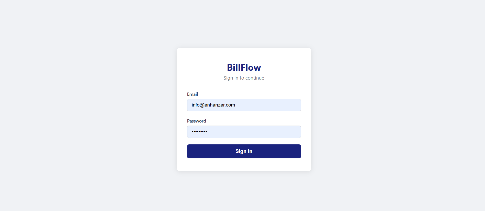
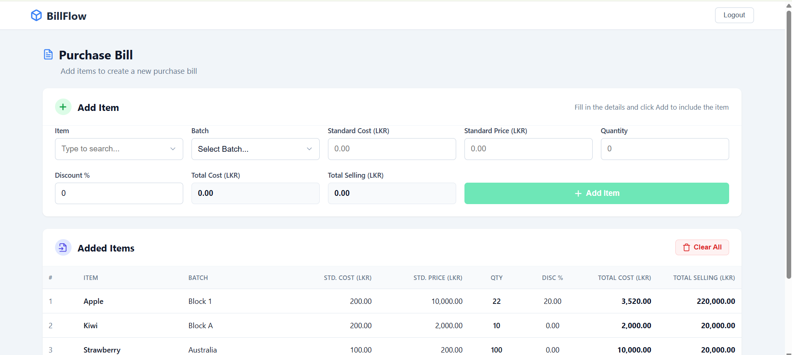
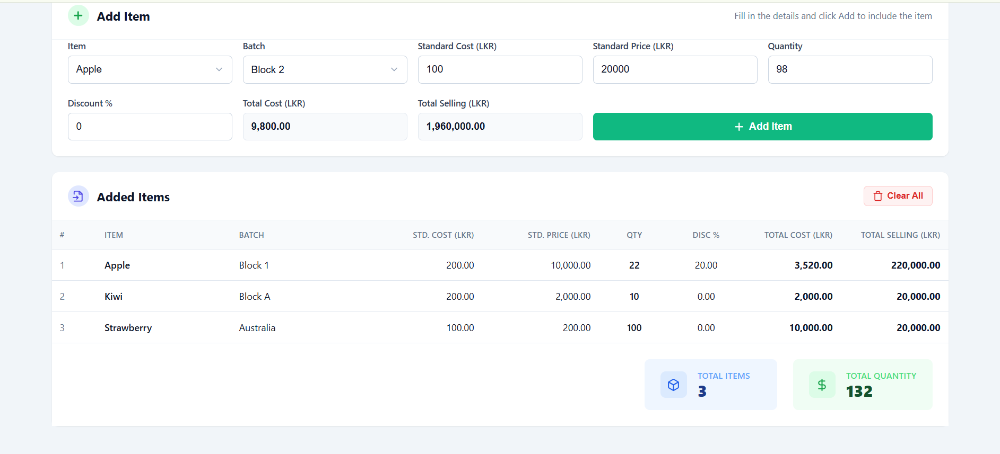

# BillFlow

BillFlow is a full-stack Purchase Bill application developed as a technical assessment. It provides external authentication, location data synchronization, and a UI for managing purchase bills with server-side calculation and validation.

## Screenshots

### Login


### Purchase Bill


### Added Items


## Features

Authentication:
- Login through the provided external API
- Backend authentication handling
- JWT session management
- HttpOnly cookie storage
- Protected Purchase Bill route
- Angular authentication guard (`authGuard`)

Location Handling:
- Locations received after successful authentication
- Unique locations saved to SQL Server `Location_Details` table
- Batch dropdown dynamically populated from saved locations

Purchase Bill:
- Fruit item autocomplete with filtering
- Allowed items: Mango, Apple, Banana, Orange, Grapes, Kiwi, Strawberry
- Batch selection using persisted location data
- Form inputs: Standard Cost, Standard Price, Quantity, Discount %
- Total Cost calculation
- Total Selling calculation
- Server-side calculation and data validation
- Add Item functionality
- Added Items table
- Total Items and Total Quantity summary blocks
- Frontend persistence of added items using `localStorage`
- Validation states (form feedback)
- Loading and error states
- Responsive grid-based UI

## Calculation Logic

Calculations are performed and validated on the backend before being returned to the frontend.

Total Cost = 
(Standard Cost × Quantity) - ((Standard Cost × Quantity) × Discount / 100)

Total Selling = 
Standard Price × Quantity

Example:
- Standard Cost = 100
- Standard Price = 150
- Quantity = 5
- Discount = 20%

Total Cost = 400
Total Selling = 750

## Architecture

Angular Frontend
        |
ASP.NET Core REST API
        |
External Login API & SQL Server Database

The Angular frontend manages user interactions and presentation. The ASP.NET Core backend acts as an intermediary, managing JWT authentication cookies, communicating with the external API, persisting location data, and executing calculation logic.

## Project Structure

```text
billflow/
├── backend/
│   ├── Controllers/
│   ├── Data/
│   ├── DTOs/
│   ├── Models/
│   └── Services/
├── frontend/
│   ├── src/
│   │   ├── app/
│   │   └── environments/
├── database/
│   └── EnhanzerAssessmentDb.sql
├── docs/
│   └── screenshots/
└── README.md
```

## Prerequisites

- .NET 8 SDK
- Node.js
- npm
- Angular CLI
- SQL Server / SQL Server Express
- SQL Server Management Studio or equivalent

## Database Setup

1. Open SQL Server Management Studio.
2. Connect to your SQL Server instance (e.g., `.\SQLEXPRESS`).
3. Manually create a new database named `EnhanzerAssessmentDb` (the SQL script does not create the database itself).
4. Run the script provided at `database/EnhanzerAssessmentDb.sql` against the new database.
5. This script creates the `__EFMigrationsHistory` tracking table and the `dbo.Location_Details` table.

Note: The location records are not seeded. They are populated dynamically from the external login API response after successful authentication.

## Backend Setup

Navigate to the backend directory and restore dependencies:

```bash
cd backend
dotnet restore
```

Configure your JWT Key using .NET User Secrets:

```bash
dotnet user-secrets init
dotnet user-secrets set "Jwt:Key" "your-secure-development-key-must-be-long-enough"
```

Ensure your connection string is set up to match your SQL Server instance:

```bash
dotnet user-secrets set "ConnectionStrings:DefaultConnection" "Server=.\SQLEXPRESS;Database=EnhanzerAssessmentDb;Trusted_Connection=True;TrustServerCertificate=True;"
```

Start the backend:

```bash
dotnet run
```

Note the localhost URL printed in the console (e.g., `http://localhost:5198`).

## Frontend Setup

Navigate to the frontend directory and install dependencies:

```bash
cd frontend
npm install
```

Configure the backend URL. Open `frontend/src/environments/environment.ts` and ensure `apiBaseUrl` matches the exact URL printed by `dotnet run`.

Example:
```typescript
export const environment = {
  production: false,
  apiBaseUrl: 'http://localhost:5198'
};
```

Start the Angular development server:

```bash
ng serve
```

The frontend will be available at `http://localhost:4200`.

## Running the Application

1. Start SQL Server.
2. Configure backend settings (JWT Key, Connection String).
3. Start the backend (`dotnet run`).
4. Confirm frontend environment API URL matches the backend.
5. Start the frontend (`ng serve`).
6. Open the Angular application at `http://localhost:4200`.
7. Login using the provided assessment test credentials.
8. Use the Purchase Bill functionality.

## API Endpoints

| Method | Endpoint | Authentication | Purpose |
| --- | --- | --- | --- |
| POST | `/api/auth/login` | Public | Authenticates against external API, sets HttpOnly JWT, saves locations |
| GET | `/api/auth/me` | Protected | Verifies active session token validity |
| POST | `/api/auth/logout` | Protected | Clears the HttpOnly JWT cookie |
| GET | `/api/locations` | Protected | Retrieves saved locations from SQL Server |
| POST | `/api/purchase-bill/calculate` | Protected | Validates request and calculates billing totals |

## Validation

- **Required Values**: All form fields are required.
- **Allowed Fruits**: Item must be exactly one of the allowed fruits. Validated by custom Angular validator and ASP.NET Core `[AllowedValues]`.
- **Quantity**: Must be an integer greater than 0.
- **Costs/Prices**: Standard Cost and Standard Price must be values > 0.
- **Discount**: Must be between 0 and 100 inclusive.
- **Batch**: Must be a valid selected location code populated from the database.

## Security

- **HttpOnly Cookie**: The JWT is stored in an HttpOnly cookie so frontend JavaScript cannot directly access the token.
- **No Token in LocalStorage**: Authentication tokens are not stored in localStorage.
- **Credentials Protection**: User credentials and external API tokens are not logged or persisted on the server.
- **Protected Endpoints**: Backend controllers use `[Authorize]` enforcing session requirements.
- **Route Guards**: Angular implements `authGuard` validating session state against `/api/auth/me` to protect internal views.

Note: Added Purchase Bill table rows are currently stored in `localStorage` strictly as a frontend persistence demo to survive browser refreshes. This is distinct from authentication data, which is completely isolated.

## Responsive Design

The Purchase Bill interface uses a grid layout adapting across breakpoints. On smaller screens, the layout stacks, and the data table leverages horizontal scroll wrappers (`overflow-x: auto`) to prevent breaking the viewport while maintaining column alignments.

## Build Verification

To verify production builds:

Backend:
```bash
cd backend
dotnet build
```

Frontend:
```bash
cd frontend
ng build
```

## SQL Script

The `database/EnhanzerAssessmentDb.sql` script explicitly creates the `__EFMigrationsHistory` tracking table and the `Location_Details` table (Id, LocationCode, LocationName).

## Notes

- External authentication depends entirely on the availability of the provided external staging API.
- Location data is populated following successful authentication.
- All Purchase Bill calculations and constraint validations are handled on the backend.
- The Purchase Bill rows themselves are not saved to the database in this assessment scope.

## Author

Developed by [Your Name]
